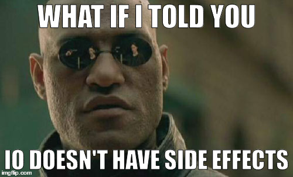

% Haskell: Avoid success at all cost
% Dhananjay and Rémi
% October 19, 2016


is **purely functional** , **general purpose**, **lazily** evaluated programming language with a **strong type system**.

-------------------------------------------------------------------------------

# Haskell - Where, when, who?

- Named after *Haskell Curry* (logician)
- 1987: *>= 12 non-strict*, purely functional programming languages existed
- 1987 bis: Committee should be formed to define an open standard
- Purpose: Consolidate the existing FPL into a common one, basis for future research
- 1990: First version of Haskell

-------------------------------------------------------------------------------

# Haskell ecosystem

- Glorious/Glasgow Haskell Compiler (*GHC*)
- Stack: cli tool to: 
    - Install GHC for you
    - Install packages
    - Build Haskell projects
    - Test Haskell projects
    - LTS snapshots for haskell libraries.
    - etc.
- Stackage/Hackage: central package archive for Haskell.
- Hoogle: Haskell code search engine


-------------------------------------------------------------------------------

## Pure and Functional?

- *Functions* (mathematical, not procedures) are first-class, that is, functions are values which can be used in exactly the same ways as any other sort of value.

- The meaning of Haskell programs is centered around **evaluating expressions** rather than **executing instructions**.

- No mutation! Everything (variables, data structures…) is immutable.

- Expressions never have “side effects” (like updating global variables or printing to the screen).

- Calling the same function with the same arguments results in the same output every time. Programs are deterministic.

-----------------------------------------------------------------------------------

*Guaranteed  not to launch rockets*


---------------------------------------------------------------------------------


- Boxes are replaceable
- Split boxes as much as you want (a.k.a partial application)
- Polymorphic functions 

--------------------------------------------------------------------------------------

. . .


```haskell
> :t (+)
(+) :: Num a => a -> a -> a -- Function with two arguments
> :t (1 +)
(1 +) :: Num a => a -> a    -- Expect one more argument
> :t 42
42 :: Num t => t            -- Function with no argument!
```

. . .

### Top haskell question ever...

Where is my `loop`?

------------------------------------------------------------------------------

## Expressions, not Executions

### Java
```java
int acc = 0;
for ( int i = 0; i < lst.length; i++ ) {
  acc = acc + 3 * lst[i];
}
```


### Haskell

```haskell
sum (map (3*) lst)
```

-------------------------------------------------------------------------------


-------------------------------------------------------------------------------

Sure, we can have side effects...

```haskell
main = putStrLn "Hello World"
```

-------------------------------------------------------------------------------

Let's read the content of a file, and map each word to its length:

. . .

```bash
#!/bin/bash

Input = "foo bar baz"
```

```bash
Output = "3 3 3"
```

```bash
$ echo "foo bar baz" | hsMap
3 3 3
```

-------------------------------------------------------------------------------

We need:

```haskell
words :: String -> [String]
unwords :: [String] -> String
length :: String -> Int
show :: Int -> String
```

-------------------------------------------------------------------------------

And then let's compose:

```haskell
interact :: (String -> String) -> ?
-- 1. Reads stdin
-- 2. Calls a function on it (String -> String)
-- 3. Prints on stdout
```

. . .

```haskell
main = interact (unwords . map (show . length) . words)
```

where:

```haskell
(.) :: (b -> c) -> (a -> b) -> a -> c
```

Remember `f . g` in math class?

-------------------------------------------------------------------------------

And then let's compose:

```haskell
interact :: (String -> String) -> ?
-- 1. Reads stdin
-- 2. Calls a function on it (String -> String)
-- 3. Prints on stdout

main = interact (unwords . map (show . length) . words)
```

Same as:

```haskell
main = interact go
    where
        go str =
            let tokens = words str
                lengths = map length tokens
                result = unwords (map show lengths)
            in result
```


-------------------------------------------------------------------------------

But what's the type of these effectful functions?

```haskell
interact :: (String -> String) -> IO ()

main :: IO ()
main = putStrLn "Hello World"
```

. . .

Could be read as:

```c
void main() {
    printf("Hello World\n");
}
```

But with completly different semantics!

-------------------------------------------------------------------------------



-------------------------------------------------------------------------------


-------------------------------------------------------------------------------

Immutable data structure?

-------------------------------------------------------------------------------

Immutable data structure?


-------------------------------------------------------------------------------

- Interesting fact: Any impure data-structure can be approximated in a pure language with an added $log(n)$ factor.

- Hint: Simulate random access/mutation with a tree-like data-structure

- *Pippenger [1996]*

-------------------------------------------------------------------------------

- But... Some of them can be solved with same asymptotic complexity using laziness

- *Bird, Jones and De Moore [1997]*

- Reference for pure, lazy data-structures: *Chris Okasaki's "Purely Functional Data Structures" [1998]*

-------------------------------------------------------------------------------

### Consequences: revisited

At the end, it can even bring benefits!

- Easy to compose (DRY, manage complexity)
- Easy to test (property-based testing)
- Easier to understand (small functions, isolate IO)
- Compiler can perform very aggressive optimizations (deforestation, fusion, etc.)

-------------------------------------------------------------------------------

## Static strong typing

- All types are known at compile-type
- Compiler is able to *infer* types

```haskell
> :t [1, 2, 3, 4]
[1, 2, 3, 4] :: Num t => [t]
> :t 42
42 :: Num a => a
> :t "Hello World!"
"Hello World!" :: [Char]
```

...But you can specify them, mostly to check your understanding of the program!

-------------------------------------------------------------------------------

Let's implement a simple `len` function:

```haskell
len (_:xs) = 1 + len xs
```

. . .

And see what compilation tells us:

```
types.hs:3:1: warning: [-Wmissing-signatures]
    Top-level binding with no type signature:
      len :: forall t a. Num a => [t] -> a

types.hs:3:1: warning: [-Wincomplete-patterns]
    Pattern match(es) are non-exhaustive
    In an equation for ‘len’: Patterns not matched: []
```

Note: This works on any user-defined type too!!

-------------------------------------------------------------------------------

Let's make GHC happy:

```haskell
len :: [a] -> Int
len [] = 0
len (_:xs) = 1 + len xs
```

. . .

### Consequences

- Less bugs
- Documentation can be wrong, types cannot (but write both!)
- Data convertions are explicit
- Hoogle! (search engine using types)

-------------------------------------------------------------------------------

## Lazy?

- Nothing is evaluated unless it's needed

```haskell
-- This is super cheap, even if the list is huge
take 10 (sort hugeList)
```
It's difficult to reason about complexity.

. . .

### Consequences

- More modularity
- Easier code reuse
- Avoid unneeded computations

-------------------------------------------------------------------------------

## Example 1: Diagrams

- Declarative domain-specific language (*DSL*)
- *Creating vector graphics*

{ width=150px }

-------------------------------------------------------------------------------

```haskell
import Diagrams.Backend.SVG.CmdLine
import Diagrams.Prelude

sierpinski :: Integer -> Diagram B
sierpinski 1 = triangle 1
sierpinski n =     s
                  ===
               (s ||| s) # centerX
    where s = sierpinski (n - 1)

main = mainWith (sierpinski 10)
```

- *Composition*
- *Custom operators*

-------------------------------------------------------------------------------

## Example 2: Fibonacci

- $F_0 = 0$
- $F_1 = 1$
- $F_n = F_{n-1} + F_{n-2}$

0, 1, 1, 2, 3, 5, 8, 13

```haskell
fibo :: Integer -> Integer
fibo 0 = 0
fibo 1 = 1
fibo n = fibo (n - 1) + fibo (n - 2)
```

Can we just memoize to avoid repetition?

-------------------------------------------------------------------------------

Or maybe we can just use purity and laziness...

```haskell
fibs :: [Integer]
fibs = 0 : 1 : zipWith (+) fibs (tail fibs)

-- Just computes what is needed + runtime memoizes for us
fibo n = fibs !! n
```


-------------------------------------------------------------------------------

{ width=230 }

-------------------------------------------------------------------------------

{ width=230 }

-------------------------------------------------------------------------------

{ width=230 }

-------------------------------------------------------------------------------

{ width=230 }

-------------------------------------------------------------------------------

{ width=230 }

-------------------------------------------------------------------------------

{ width=230 }

-------------------------------------------------------------------------------

This showcases:

- Lazyness
- Purity

This is actually a simple example of a very powerful method to do dynamic programming.

-------------------------------------------------------------------------------

# Haskell and other languages

-------------------------------------------------------------------------------

# So, why Haskell?

- Strong type safety, less errors
- Purity, less errors...
- Refactoring is a no-brainer
- Easy parallelization
- Mature language, mature ecosystem
- Type system actually helps you reason about your program (TDD)

-------------------------------------------------------------------------------

# Resources to learn Haskell

- Learning haskell from first principles

-------------------------------------------------------------------------------
